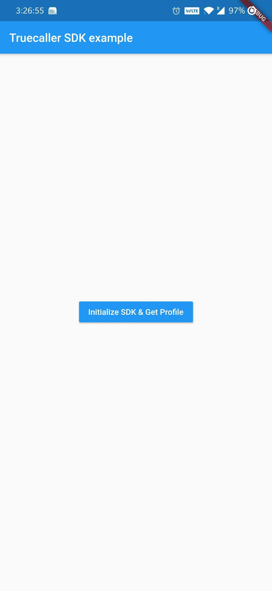
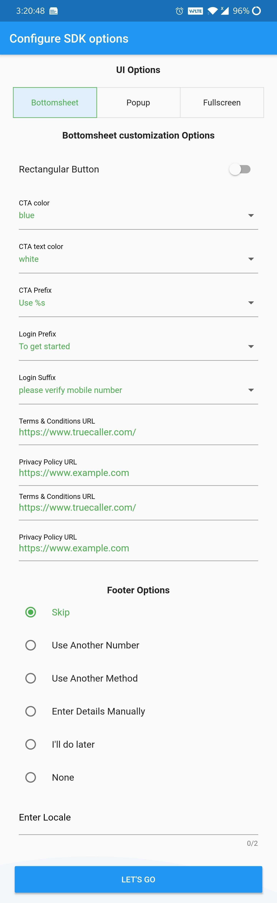

# truecaller_sdk_example

Demonstrates how to use the `truecaller_sdk` plugin.

You can find 2 example implementations under [example/lib](lib) directory

1. [main.dart](https://github.com/truecaller/flutter-sdk/blob/master/example/lib/main.dart) - run this to see a very basic, crude implementation of
 truecaller_sdk plugin which would look like the below screenshot

2. [main_customization_screen.dart](https://github.com/truecaller/flutter-sdk/blob/master/example/lib/customization/main_customization_screen.dart) - run
 this to see different customization options available for truecaller_sdk plugin which would look like the below screenshot

